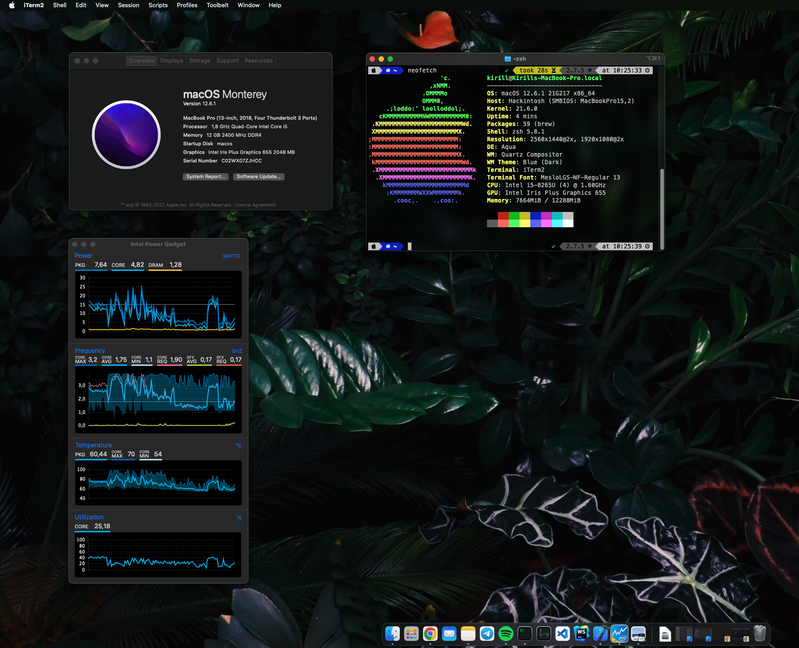

## OpenCore Configuration for ASUS X512FL

Monterey 12.6.1
 

## Spec Sheet
| Part        | Specs                            |
|-------------|----------------------------------|
| CPU         | i5-8265U                         |
| RAM         | 12GB(1 free slot,1 onboard)      |
| iGPU        | Intel UHD 620 (use Iris 655)     |
| dGPU        | Nvidia MX250 (disabled)          |
| WiFi        | 0x8086, 0x2A4, itlwm (en0)       |
| Audio       | Realtek ALC256 Layout-id 15      |
| SSD         | Kingston Nvme 526gb              |
| Touchpad    | PS2 Controller                   |
| SDCard      | unused                           |
| Screen      | 1920x1080                        |

## Working
2. All USB
3. Wireless AC
4. Bluetooth
5. HDMI
6. Touchpad
7. Sleep
8. Power Management
9. Appstore, iMessage, FaceTime

## Not Working 
1. WebCam
2. Realtek SD Card (No tested)
4. Britness keys

## References
1. [Dortania's guide](https://github.com/dortania/vanilla-laptop-guide)
2. [Hackintosh Reddit and Discord](https://reddit.com/r/hackintosh)
3. [hieplpvip's AsusSMC](https://github.com/hieplpvip/AsusSMC)
4. [acidanthera](https://github.com/acidanthera)
